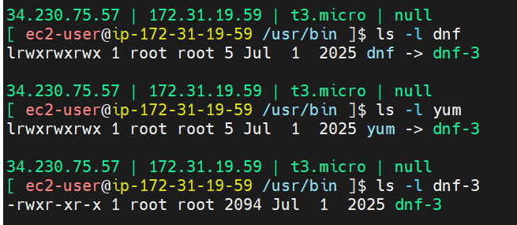

## Inode
Write commands to create symlink & hardlink
stat linux.txt
## Symlink
symlink and file have different inode number

Example of symlink application - 
dnf and yum (in /usr/bin) symlink files of dnf-3

safe to switch versions without  server downtime
Rollback is also easy
## Hardlink
How to find the number of hardlinks with inode?
Hardlinks vs Simlinks