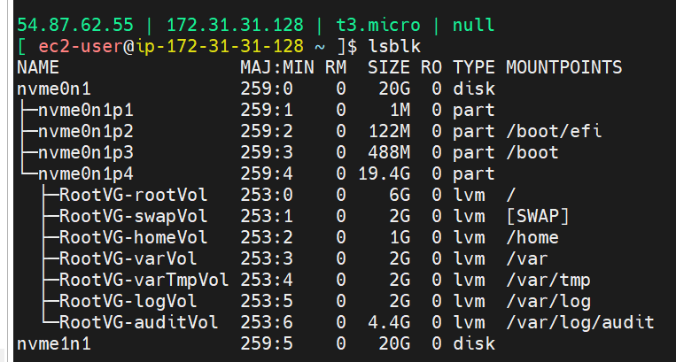
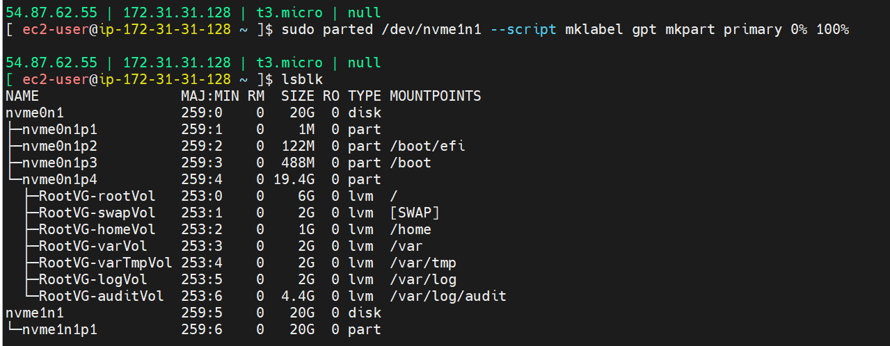
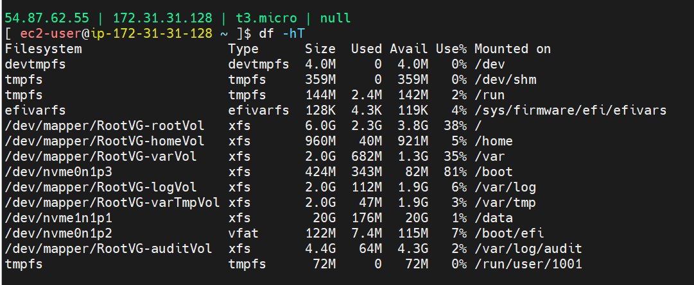
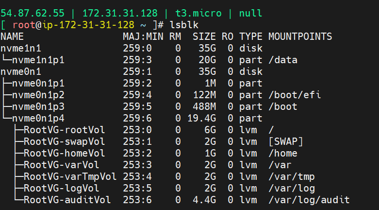
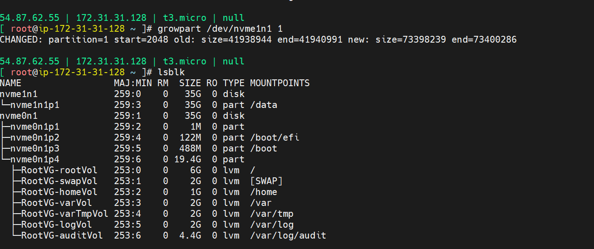
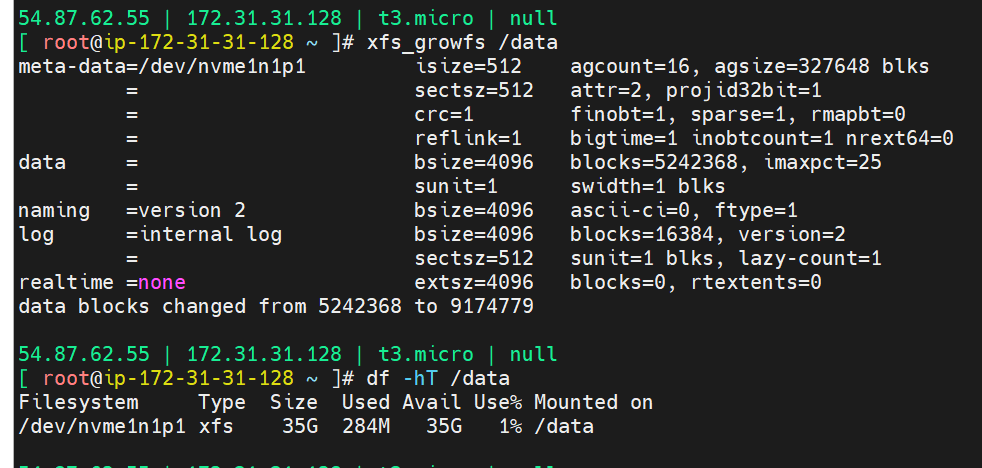

### Linux disk management
### How to add extra disk to a running EC2 instance?
## Add and attach additional disk to AWS Linux server 
- Create AWS EBS volume (equivalent to harddisk) in the same availability zone as the Linux instance
- Database, important files and configuration files are stored here
Create EBS volume (manual)
Attach EBS volume to EC2 instance
- Attach to the instance 
## List block devices on Linux
`lsblk`

nvme0n1 - root disk
nvme1n1 - new disk

## partition, format, mount, and persist EBS disk on EC2 instance
File system hierarchy 

- Create partitions in the EBS volume
`sudo parted /dev/nvme1n1 --script mklabel gpt mkpart primary 0% 100%`

- Create file system 
`sudo mkfs.xfs -f /dev/nvme1n1p1`

Mount the volume to a directory  - temporary
`sudo mkdir -p /data
sudo mount /dev/nvme1n1p1 /data`
Verify 
`df -hT | grep data`

To mount permanently, persist - use UUID 
get UUID with this command
`sudo blkid /dev/nvme1n1p1`

UUID = 3c9c9bd0-537d-47db-9859-ebfdba6d4020

Add below line to end of the file fstab
UUID=3c9c9bd0-537d-47db-9859-ebfdba6d4020   /data   xfs   defaults,nofail   0   2
`sudo vim /etc/fstab`
`mount -a`
After reboot volume should persist 
sudo reboot

Note the UUID of the block or new volume attached
add to fstab
mount -a
Automate this with ansible

Extend current EBS disk to 35 GB (Manual)

If you are increasing the size of the volume, you must extend the file system to the new size of the volume. You can only do this when the volume enters the optimizing state.

modify in the AWS Instance

## Grow partition 
`growpart /dev/nvem1n1 1`
Mount grown partition 
`xfs_growfs /data`

`df -hT /data`

### Memory management commands

## Check hard disk for directories mounted, usage , (h is human readable format) 
`df -hT` 

## Ram usage
`free -m`
`free -h`
Mi is MB
Swap is virtual RAM

## current running processes consuming memory cpu
`top`

## htop (human readable format) has to be installed
`dnf install htop -y`
`htop`

## top 10 processes consuming memory
`ps aux --sort -rss | head -10`
`ps -eo pid, `

## folder consumption within another directory
`df -hT`
`du -sh *`
## Grow partition command

`growpart /dev/nvme1n1 1`

mount to data again 
`xfs_growfs /data`

### CPU Utilization (Explain)
memory vs cpu

