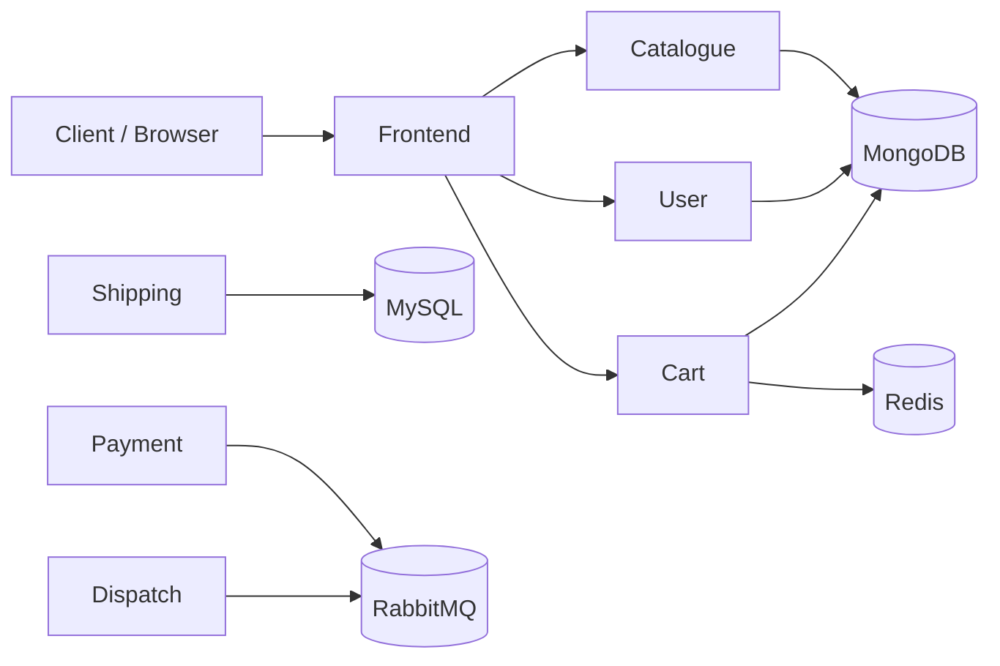
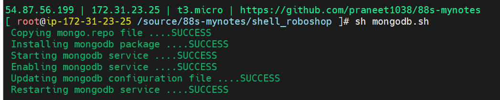
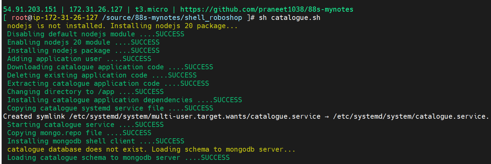
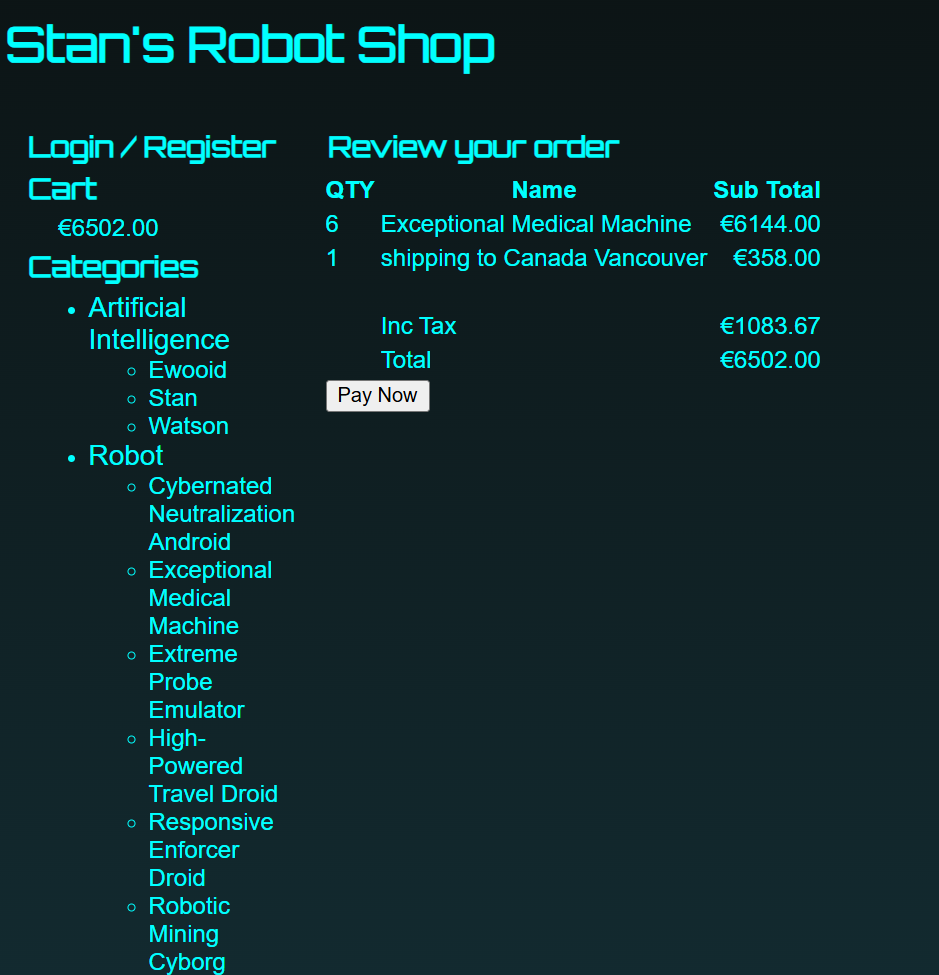

# 88s-Mynotes

<div align="center">


A hands-on Linux, shell scripting, and DevOps learning repository focused on automating a multi-service e-commerce platform.

</div>

## Overview

This repository is a personal study project built around three core areas:

- Linux administration and system fundamentals
- Shell scripting and automation best practices
- End-to-end deployment of the Roboshop e-commerce application

It combines practical notes, troubleshooting records, and executable scripts to help understand how services are installed, configured, and debugged in a real Linux environment.

## Why This Project Exists

The goal of this repo is to strengthen practical DevOps skills by working through real-world tasks such as:

- managing Linux filesystems and system resources
- writing reusable shell scripts for service setup
- configuring multi-service app stacks
- validating deployments with logs and service checks
- debugging broken automation and fixing configuration issues

## Architecture



This project follows the Roboshop microservice-style deployment pattern, where each component is configured separately and then connected through common infrastructure services.

## Topics Covered

### Linux Fundamentals

- inode concepts
- filesystem layout
- directory structure
- disk management
- service and system administration basics

### Shell Scripting

- variables and input handling
- conditions and loops
- functions and reusable code
- logging and error handling
- traps and cleanup logic
- idempotent automation patterns

### Roboshop Deployment

The repository includes scripts and notes for deploying services such as:

- Frontend
- Catalogue
- User
- Cart
- Shipping
- Payment
- MongoDB
- MySQL
- Redis
- RabbitMQ
- Dispatch

## Repository Structure

```text
88s-mynotes/
├── Linux Advanced/
│   ├── inode.md
│   ├── linux_directory_structure.md
│   └── linux_disk_management.md
├── Roboshop/
│   ├── cart.md
│   ├── catalogue.md
│   ├── frontend.md
│   ├── mongodb.md
│   ├── mysql.md
│   ├── payment.md
│   ├── rabbitmq.md
│   ├── redis.md
│   ├── shipping.md
│   ├── user.md
│   └── ...
├── shell_roboshop/
│   ├── cart.sh
│   ├── catalogue.sh
│   ├── dispatch.sh
│   ├── frontend.sh
│   ├── mongodb.sh
│   ├── mysql.sh
│   ├── payment.sh
│   ├── rabbitmq.sh
│   ├── redis.sh
│   ├── roboshop.sh
│   ├── shipping.sh
│   ├── user.sh
│   ├── *.service
│   ├── notes.md
│   ├── troubleshooting.md
│   └── image-*.png
├── shell_scripting/
│   ├── 01-helloworld.sh
│   ├── 03-variables.sh
│   ├── 08-datatypes.sh
│   ├── 11-functions.sh
│   ├── 13-loops.sh
│   ├── 15-errorhandling-set.sh
│   ├── 16-errorhandling-trap.sh
│   └── notes.md
├── README.md
├── .gitignore
└── .vscode/
```

## Quick Start

Clone the repository and explore the scripts:

```bash
git clone https://github.com/<your-user>/<your-repo>.git
cd 88s-mynotes
ls
```

Review the shell automation folder:

```bash
cd shell_roboshop
ls
```

Run a script manually:

```bash
bash mongodb.sh
bash catalogue.sh
bash frontend.sh
```

Validate script syntax before execution:

```bash
bash -n catalogue.sh
```

## Screenshots

Some examples from the project’s learning and deployment workflow:

<div align="center">








</div>

## Troubleshooting Notes

This repo also records common issues encountered during setup and deployment, including:

- incorrect variable references
- missing configuration values
- broken service dependency checks
- wrong application URLs
- MongoDB connectivity issues
- Route53 and domain-related configuration problems

These notes help reinforce practical debugging instead of only focusing on success flows.

## Notes

This is a learning-focused repository intended for experimentation and hands-on practice. It is not meant to be treated as a production-ready deployment framework, but it is a strong working example of Linux and automation concepts in action.

## License

Educational use only.

## Author

Built as a Linux and DevOps learning project.
