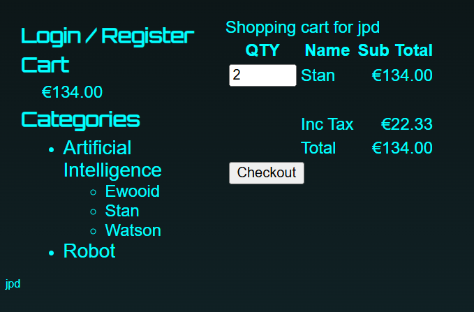

## Launch new instance for cart 
## install nodejs 20v
```dnf module disable nodejs
dnf module enable nodejs:20
dnf module install nodejs
```

## Extract cart application to /app
```
mkdir /app
curl -L -o /tmp/cart.zip https://roboshop-artifacts.s3.amazonaws.com/cart-v3.zip
cd /app 
unzip /tmp/cart.zip
```
## Setup Cart service
## update redis & catalogue ip addresses
```
vim /etc/systemd/system/cart.service
systemctl daemon-reload
systemctl enable cart
systemctl start cart

```

## go back to frontend to configure user & cart app urls in nginx.conf



## Troubleshooting

"" connection refused error 
curl http://localhost:8080/health
curl: (7) Failed to connect to localhost port 8080: Connection refused


{"level":"error","time":1788821302577,"pid":9802,"hostname":"ip-172-31-18-83.ec2.internal","msg":"Redis ERROR {\"errno\":-3008,\"code\":\"ENOTFOUND\",\"syscall\":\"getaddrinfo\",\"hostname\":\"redis\"}","v":1}
{"level":"error","time":1788821302921,"pid":9802,"hostname":"ip-172-31-18-83.ec2.internal","msg":"Redis ERROR {\"errno\":-3008,\"code\":\"ENOTFOUND\",\"syscall\":\"getaddrinfo\",\"hostname\":\"redis\"}","v":1}
{"level":"error","time":1788821303501,"pid":9802,"hostname":"ip-172-31-18-83.ec2.internal","msg":"Redis ERROR {\"errno\":-3008,\"code\":\"ENOTFOUND\",\"syscall\":\"getaddrinfo\",\"hostname\":\"redis\"}","v":1}
{"level":"error","time":1788821304486,"pid":9802,"hostname":"ip-172-31-18-83.ec2.internal","msg":"Redis ERROR {\"errno\":-3008,\"code\":\"ENOTFOUND\",\"syscall\":\"getaddrinfo\",\"hostname\":\"redis\"}","v":1}
{"level":"error","time":1788821306159,"pid":9802,"hostname":"ip-172-31-18-83.ec2.internal","msg":"Redis ERROR {\"errno\":-3008,\"code\":\"ENOTFOUND\",\"syscall\":\"getaddrinfo\",\"hostname\":\"redis\"}","v":1}
{"level":"error","time":1788821309003,"pid":9802,"hostname":"ip-172-31-18-83.ec2.internal","msg":"Redis ERROR {\"errno\":-3008,\"code\":\"ENOTFOUND\",\"syscall\":\"getaddrinfo\",\"hostname\":\"redis\"}","v":1}
{"level":"error","time":1788821313836,"pid":9802,"hostname":"ip-172-31-18-83.ec2.internal","msg":"Redis ERROR {\"errno\":-3008,\"code\":\"ENOTFOUND\",\"syscall\":\"getaddrinfo\",\"hostname\":\"redis\"}","v":1}

