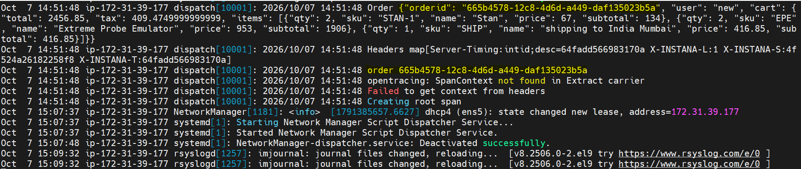

### Install Golang

`dnf install golang -y`

### Create application user - roboshop
`useradd --system --home /app --shell /sbin/nologin --comment "roboshop system user" roboshop`

### Download and extract displatch application

```
mkdir /app 
curl -L -o /tmp/dispatch.zip https://roboshop-artifacts.s3.amazonaws.com/dispatch-v3.zip 
cd /app
unzip /tmp/dispatch.zip
```

### Install dependencies and Build application

```
cd /app 
go mod init dispatch
go get 
go build
```

### Create dispatch service
`vim /etc/systemd/system/dispatch.service`

### Load the service, enable & start the service
```systemctl daemon-reload 
systemctl enable dispatch
systemctl start dispatch
``` 

### Output 

