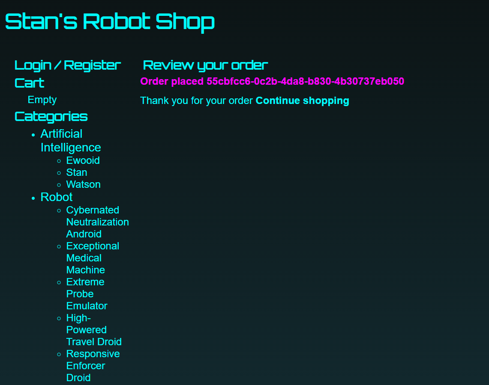

## install nginx 1.24
```dnf module list nginx
dnf module disable nginx
dnf module enable nginx:1.24 -y
dnf module install nginx -y
systemctl enable nginx
systemctl start nginx
```

## check nginx installation in browser. Should load the default Red Hat Enterprise Linux Test Page
 
http://3.91.233.131/


## remove default content 
``` 
rm -rf /usr/share/nginx/html/* 
```
## download frontend content
```
curl -o /tmp/frontend.zip https://roboshop-artifacts.s3.amazonaws.com/frontend-v3.zip
```
## extract frontend application content

```cd /usr/share/nginx/html 
unzip /tmp/frontend.zip
```

## reload the frontend webpage(nginx service) to check if it was updated 

http://mongodb.jirawiser.online/

## create nginx reverse proxy configuration to reach backend services
vim /etc/nginx/nginx.conf

## copy this content to the conf file
```user nginx;
worker_processes auto;
error_log /var/log/nginx/error.log notice;
pid /run/nginx.pid;

include /usr/share/nginx/modules/*.conf;

events {
    worker_connections 1024;
}

http {
    log_format  main  '$remote_addr - $remote_user [$time_local] "$request" '
                      '$status $body_bytes_sent "$http_referer" '
                      '"$http_user_agent" "$http_x_forwarded_for"';

    access_log  /var/log/nginx/access.log  main;

    sendfile            on;
    tcp_nopush          on;
    keepalive_timeout   65;
    types_hash_max_size 4096;

    include             /etc/nginx/mime.types;
    default_type        application/octet-stream;

    include /etc/nginx/conf.d/*.conf;

    server {
        listen       80;
        listen       [::]:80;
        server_name  _;
        root         /usr/share/nginx/html;

        include /etc/nginx/default.d/*.conf;

        error_page 404 /404.html;
        location = /404.html {
        }

        error_page 500 502 503 504 /50x.html;
        location = /50x.html {
        }

        location /images/ {
          expires 5s;
          root   /usr/share/nginx/html;
          try_files $uri /images/placeholder.jpg;
        }
        location /api/catalogue/ { proxy_pass http://localhost:8080/; }
        location /api/user/ { proxy_pass http://localhost:8080/; }
        location /api/cart/ { proxy_pass http://localhost:8080/; }
        location /api/shipping/ { proxy_pass http://localhost:8080/; }
        location /api/payment/ { proxy_pass http://localhost:8080/; }

        location /health {
          stub_status on;
          access_log off;
        }

    }
}
```
# Note - Replace localhost with catalogue subdomain

## restart nginx service
systemctl restart nginx

## Refresh the page to check catalogue loaded products from the database




##  if page is not loading troubleshoot
- Referece video - 22 Jan session 11, timestamp - 1:06:43 - 1:10:51
- Use browser developer console to debug if frontend page isn't loading products from catalogue and mongodb database.
- Request goes from frontend to catalogue(backend) to mongodb

- Check logs (access.log, error.log) - 
``` 
cd /var/log/nginx 
ls
less access.log
```
Inspect this access.log content for requests coming from your browser. May have error messages. Shift+g to last message

```
less /var/log/messages
```


## Troubleshooting
Error when adding an item to cart.- 
status code 404
User registration and logging in fine

Always check for typos in service configuration file, host names

Order errors out on clicking 'Pay' button - 
http://13.222.182.137/api/payment/pay/jpd 500 (INTERNAL SERVER ERROR)

systemctl status payment error - 

Sep 09 11:07:17 ip-172-31-30-95.ec2.internal payment[1982]: [2026-09-09 11:07:17,964] ERROR in payment: HTTPConnectionPool(host='user.jirawiser.online.com', port=8080): Max retries exceeded with url: /check/jpd (Caused by NewConnectionError('<urllib3.connection.HTTPConnection object at 0x7fd67a93e490>: Failed to establish a new connection: [Errno -2] Name or service not known'))

DNS resolution error - 

Immediately check this on payment server - 
curl http://user.jirawiser.online:8080/check/jpd
