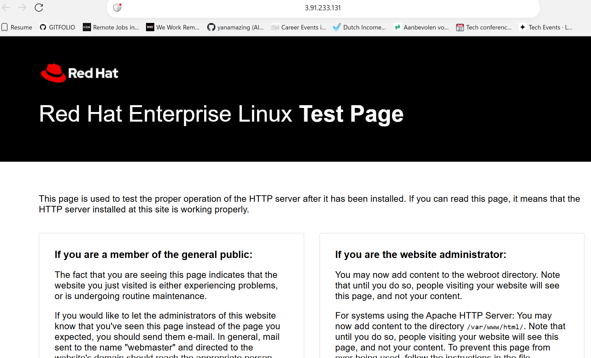
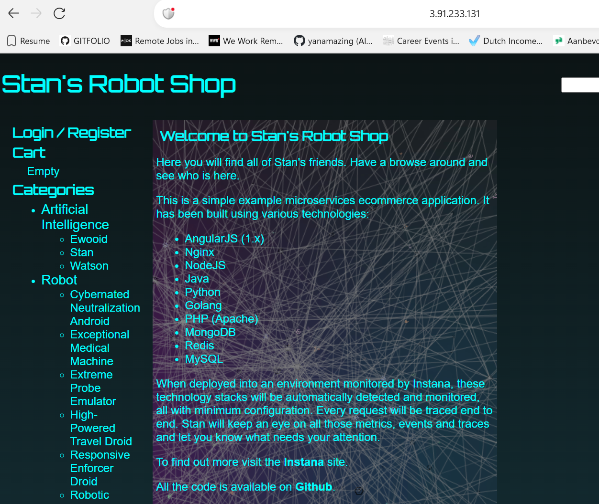

## install nginx 1.24
dnf module list nginx
dnf module disable nginx
dnf module enable nginx:1.24 -y
dnf module install nginx -y
systemctl enable nginx
systemctl start nginx

## check nginx installation in browser. Should load the default Red Hat Enterprise Linux Test Page
 
http://3.91.233.131/


## remove default content 
rm -rf /usr/share/nginx/html/* 
## download frontend content
curl -o /tmp/frontend.zip https://roboshop-artifacts.s3.amazonaws.com/frontend-v3.zip

## reload the frontend webpage(nginx service) to check if it was updated 
http://3.91.233.131/
## create nginx reverse proxy configuration to reach backend services
vim /etc/nginx/nginx.conf

## copy this content to the conf file
```user nginx;
worker_processes auto;
error_log /var/log/nginx/error.log notice;
pid /run/nginx.pid;

include /usr/share/nginx/modules/*.conf;

events {
    worker_connections 1024;
}

http {
    log_format  main  '$remote_addr - $remote_user [$time_local] "$request" '
                      '$status $body_bytes_sent "$http_referer" '
                      '"$http_user_agent" "$http_x_forwarded_for"';

    access_log  /var/log/nginx/access.log  main;

    sendfile            on;
    tcp_nopush          on;
    keepalive_timeout   65;
    types_hash_max_size 4096;

    include             /etc/nginx/mime.types;
    default_type        application/octet-stream;

    include /etc/nginx/conf.d/*.conf;

    server {
        listen       80;
        listen       [::]:80;
        server_name  _;
        root         /usr/share/nginx/html;

        include /etc/nginx/default.d/*.conf;

        error_page 404 /404.html;
        location = /404.html {
        }

        error_page 500 502 503 504 /50x.html;
        location = /50x.html {
        }

        location /images/ {
          expires 5s;
          root   /usr/share/nginx/html;
          try_files $uri /images/placeholder.jpg;
        }
        location /api/catalogue/ { proxy_pass http://localhost:8080/; }
        location /api/user/ { proxy_pass http://localhost:8080/; }
        location /api/cart/ { proxy_pass http://localhost:8080/; }
        location /api/shipping/ { proxy_pass http://localhost:8080/; }
        location /api/payment/ { proxy_pass http://localhost:8080/; }

        location /health {
          stub_status on;
          access_log off;
        }

    }
}
```
Note - 
Replace localhost with ip address of catalogue

## restart nginx service
systemctl restart nginx

## Refresh the page to check catalogue loaded products from the database

