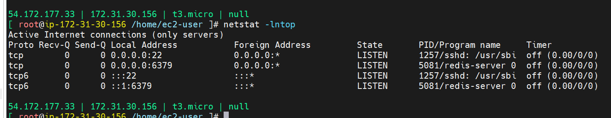

## install redis
dnf module list redis
dnf module install redis:7
## allow remote connections
# change config to update port to 0.0.0.0
# change protectmode to no 
vim /etc/redis/redis.conf 
## enable/start service 
sytemctl enable redis
sytemctl start redis
## status check
netstat -lntp
