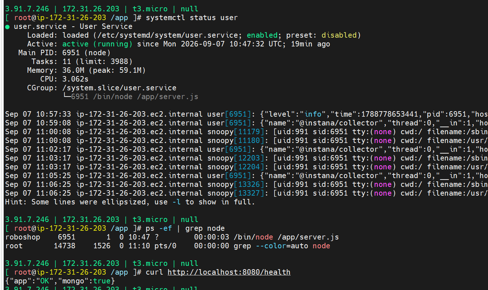
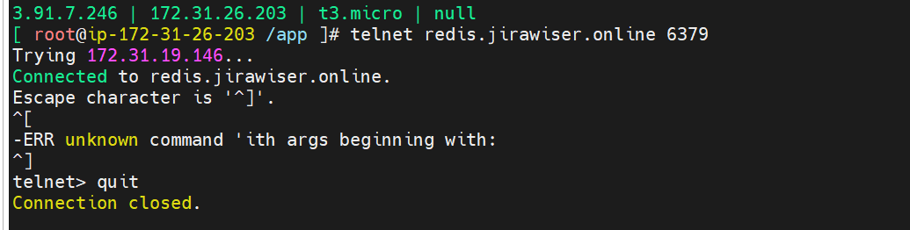
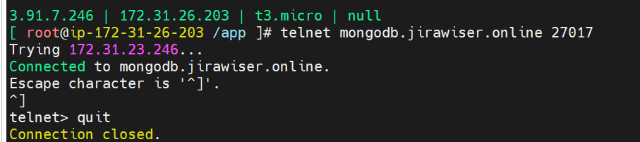

## install nodejs 20 version
```
dnf module disable nodejs
dnf module install nodejs:20
useradd --system --home /app --shell /sbin/nologin --comment "roboshop system user" roboshop


```
## Download, extract user application to /app directory
```
curl -L -o /tmp/user.zip https://roboshop-artifacts.s3.amazonaws.com/user-v3.zip 
cd /app 
unzip /tmp/user.zip
npm install 


```

## configure db servers
```
vim /etc/systemd/system/user.service
```
```
[Unit]
Description = User Service
[Service]
User=roboshop
Environment=MONGO=true
// highlight-start
Environment=REDIS_URL='redis://<REDIS-IP-ADDRESS>:6379'
Environment=MONGO_URL="mongodb://<MONGODB-SERVER-IP-ADDRESS>:27017/users"
// highlight-end
ExecStart=/bin/node /app/server.js
SyslogIdentifier=user

[Install]
WantedBy=multi-user.target
```
## Start User service
```
systemctl daemon-reload
systemctl enable user
systemctl start user
```
## Route 53 - add A record to map user subdomain  

## Status check
```
systemctl status user

netstat -lntp

ps -ef | grep node
telnet redis.jirawiser.online 6379
curl http://localhost:8080/health

```



```
telnet mongodb.jirawiser.online 27017
```

## Troubleshoot
```
telnet redis.jirawiser.online 6379
```
Ctrl+] to escape
quit to exit
