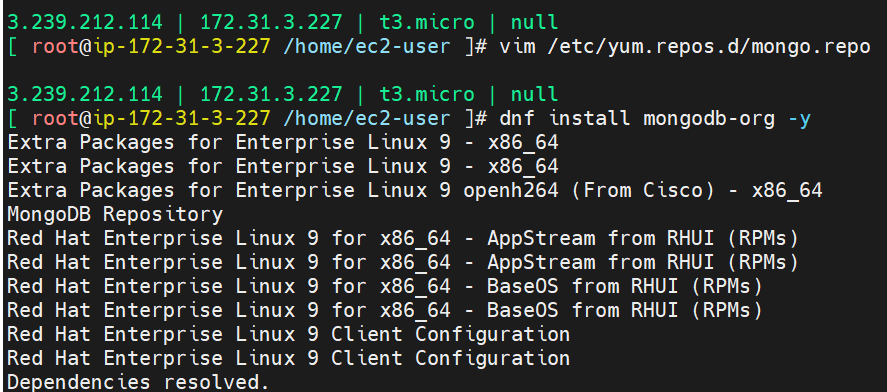
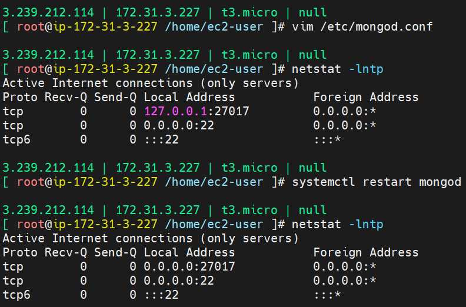

# Commands to check status of mongodb installation
[bash]
echo "hello world"

### setup mongo repo file

vim /etc/yum.repos.d/mongo.repo

### add to repo file

[mongodb-org-7.0]
name=MongoDB Repository
baseurl=https://repo.mongodb.org/yum/redhat/9/mongodb-org/7.0/x86_64/
enabled=1
gpgcheck=0

### install mongodb

dnf install mongodb-org -y 
systemctl enable mongod
systemctl start mongod

### mongod status check

systemctl status mongod ### should be active

ps -ef | grep mongo
netstat -lntp

vim /etc/mongod.conf

### replace 127.0.0.1 with 0.0.0.0

restart mongod
systemctl restart mongod

### check the status of mongod service again
should show 0.0.0.0 under tcp local address
which means service accepts traffic from all remote servers, port no. 27017

