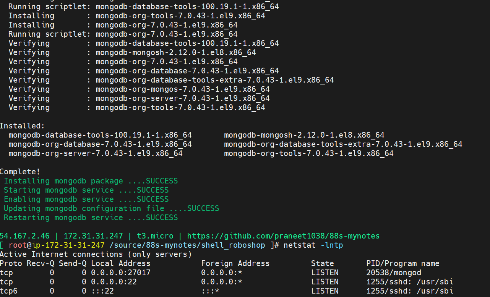

# clone git repo
mkdir /source; cd /source; git clone https://github.com/praneet1038/88s-mynotes; git switch shell-roboshop

# check if mongodb installation was successful
`netstat -lntp`
### output 

### command to check for syntax errors without executing it
`bash -n catalogue.sh`

### use trap command

# Troubleshooting
- frontend public ipaddress is not assigned in roboshop.sh. Private ip is address instead.
- incorrect variable reference for DOMAIN_NAME in roboshop.sh
- missing variable declarations - LOG_FILE & LOG_FOLDER in robosho.sh
- Troubleshooting - found & fixed these bugs in catalogue.sh

- roboshop user check failed because of incorrect exist status check at validate_execution function

- incorrect catalogue app url path

- incorrect mongo data file master-data.js.

- incorrect mongodb_host path

- Connecting to: mongodb://mongodb.jirawiser.online:27017/?directConnection=true&appName=mongosh+2.12.0
MongoNetworkError: getaddrinfo ENOTFOUND mongodb.jirawiser.online
 Loading catalogue schema to mongodb server ....FAILED

- Most probably because PKB configured jirawiser.online domain name server to his aws account route53. Retry changing this to your aws account.
