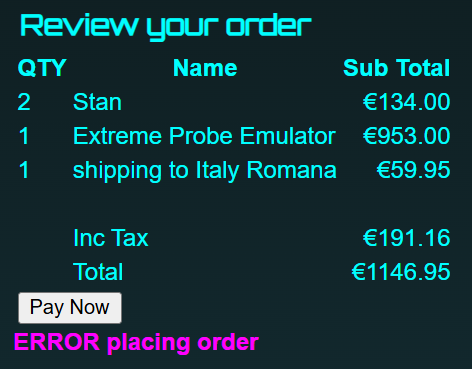
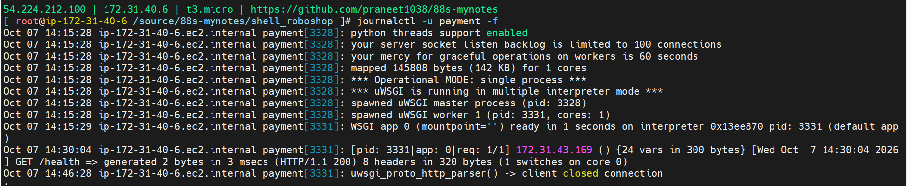

### Errors 
### Error on clicking Pay button 07/10/26

2026/10/07 13:40:20 [error] 7893#7893: *138 connect() failed (111: Connection refused) while connecting to upstream, client: 94.157.47.41, server: _, request: "POST /api/payment/pay/new HTTP/1.1", upstream: "http://172.31.43.169:8080/pay/new", host: "jirawiser.online", referrer: "http://jirawiser.online/payment"
2026/10/07 13:40:20 [error] 7893#7893: *138 open() "/usr/share/nginx/html/50x.html" failed (2: No such file or directory), client: 94.157.47.41, server: _, request: "POST /api/payment/pay/new HTTP/1.1", upstream: "http://172.31.43.169:8080/pay/new", host: "jirawiser.online", referrer: "http://jirawiser.online/payment"

2026/10/07 14:21:52 [error] 7894#7894: *184 open() "/usr/share/nginx/html/product/{{ prod.sku }}" failed (2: No such file or directory), client: 43.157.170.13, server: _, request: "GET /product/%7B%7B%20prod.sku%20%7D%7D HTTP/1.1", host: "18.232.130.199:80"

2026/10/07 14:21:52 [error] 7894#7894: *184 open() "/usr/share/nginx/html/404.html" failed (2: No such file or directory), client: 43.157.170.13, server: _, request: "GET /product/%7B%7B%20prod.sku%20%7D%7D HTTP/1.1", host: "18.232.130.199:80"
2026/10/07 14:22:25 [error] 7894#7894: *167 connect() failed (111: Connection refused) while connecting to upstream, client: 94.157.47.41, server: _, request: "POST /api/payment/pay/new HTTP/1.1", upstream: "http://172.31.43.169:8080/pay/new", host: "jirawiser.online", referrer: "http://jirawiser.online/payment"
2026/10/07 14:22:25 [error] 7894#7894: *167 open() "/usr/share/nginx/html/50x.html" failed (2: No such file or directory), client: 94.157.47.41, server: _, request: "POST /api/payment/pay/new HTTP/1.1", upstream: "http://172.31.43.169:8080/pay/new", host: "jirawiser.online", referrer: "http://jirawiser.online/payment"
2026/10/07 14:22:29 [error] 7894#7894: *188 open() "/usr/share/nginx/html/cart" failed (2: No such file or directory), client: 43.166.132.142, server: _, request: "GET /cart HTTP/1.1", host: "jirawiser.online"
2026/10/07 14:22:29 [error] 7894#7894: *188 open() "/usr/share/nginx/html/404.html" failed (2: No such file or directory), client: 43.166.132.142, server: _, request: "GET /cart HTTP/1.1", host: "jirawiser.online"

### Screenshot from payment service 

# Solution - 

Checks
- from frontend - `ping payment.jirawiser.online` - OK
- from payment - `ping user.jirawiser.online` - OK
- Command to check requests received `journalctl -u payment -f`
- on clicking pay button - request not received by payment service. 
- There was no log of the frontend request by payment service. proxies in /etc/nginx/nginx.conf on frontend checked out ok. So I restarted the nginx service `systemctl restart nginx` and that resolved the issue magically. 

